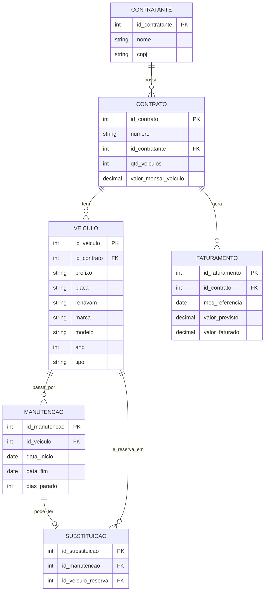

# Modelo do banco de dados

```mermaid
erDiagram
    CONTRATANTE ||--o{ CONTRATO : possui
    CONTRATO ||--o{ VEICULO : tem
    CONTRATO ||--o{ FATURAMENTO : gera
    VEICULO ||--o{ MANUTENCAO : passa_por
    MANUTENCAO ||--o| SUBSTITUICAO : pode_ter
    VEICULO ||--o{ SUBSTITUICAO : e_reserva_em

    CONTRATANTE {
        int id_contratante PK
        string nome
        string cnpj
    }
    CONTRATO {
        int id_contrato PK
        string numero
        int id_contratante FK
        int qtd_veiculos
        decimal valor_mensal_veiculo
    }
    VEICULO {
        int id_veiculo PK
        int id_contrato FK
        string prefixo
        string placa
        string renavam
        string marca
        string modelo
        int ano
        string tipo
    }
    MANUTENCAO {
        int id_manutencao PK
        int id_veiculo FK
        date data_inicio
        date data_fim
        int dias_parado
    }
    SUBSTITUICAO {
        int id_substituicao PK
        int id_manutencao FK
        int id_veiculo_reserva FK
    }
    FATURAMENTO {
        int id_faturamento PK
        int id_contrato FK
        date mes_referencia
        decimal valor_previsto
        decimal valor_faturado
    }
```
